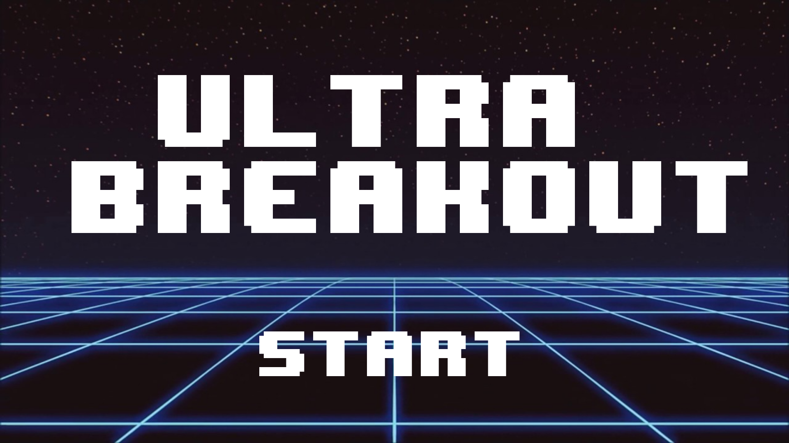
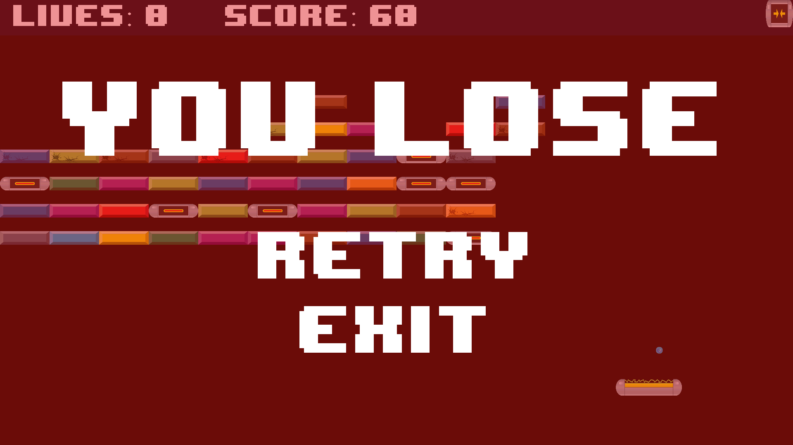
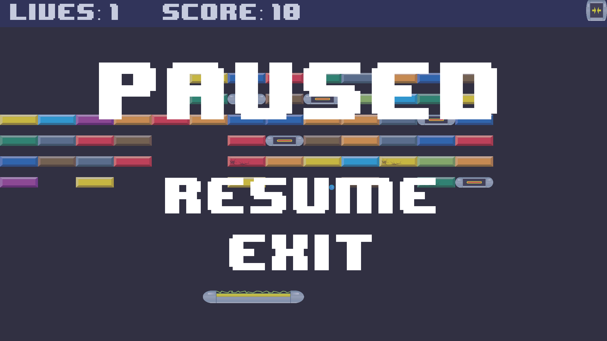
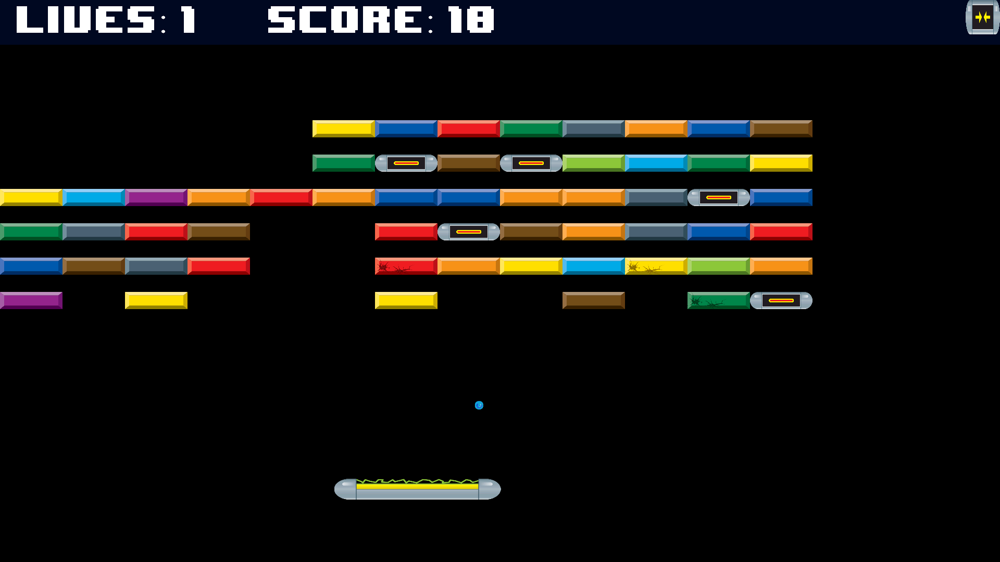
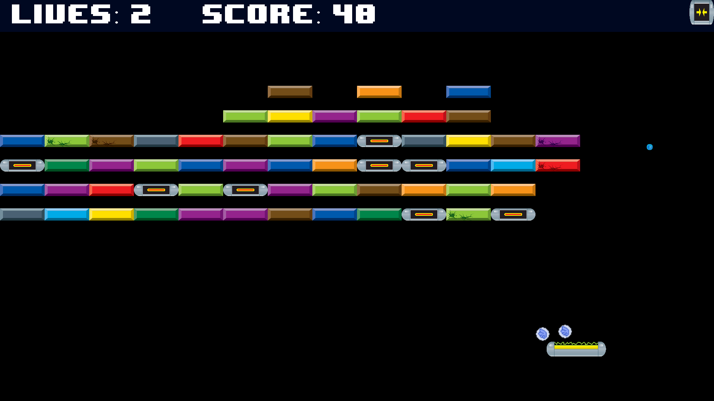
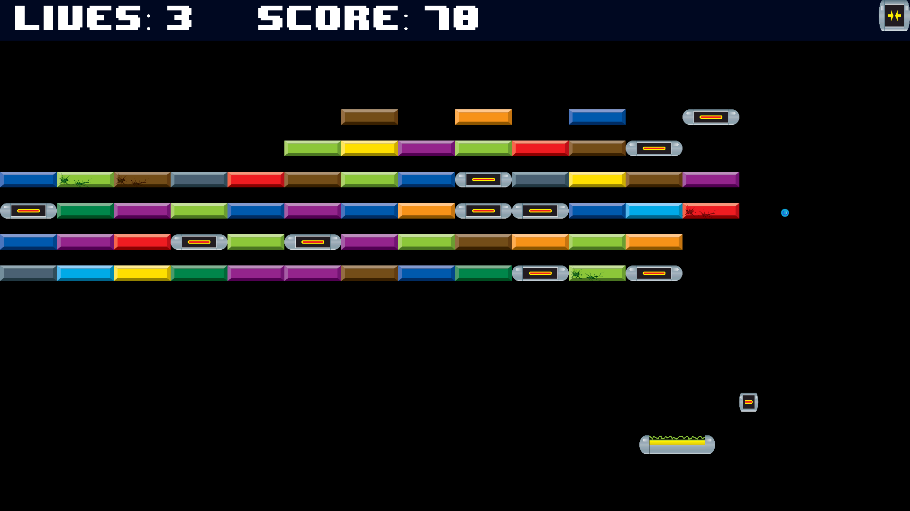
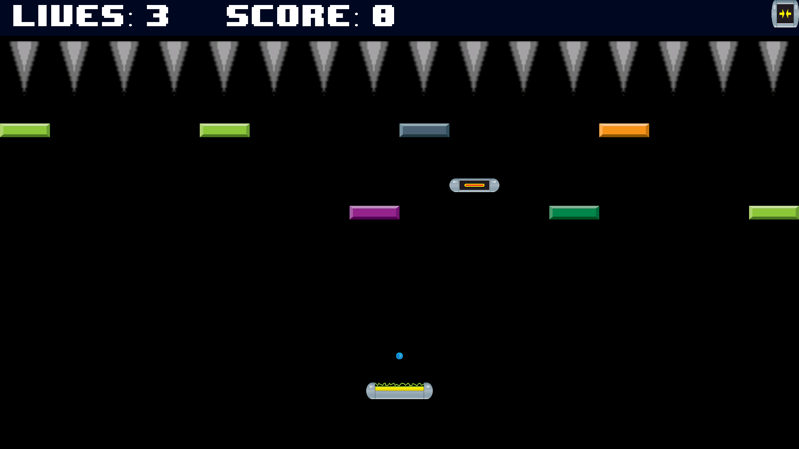

# UltraBreakout

This project is a clone of the Atari 2600 game <em>Super Breakout</em> for Android 5.1. It has sprites, music, power-ups, spikes, and levels, along with a scoring system.

### Title Screen

### GameOver Screen

### Pause Screen

### Gameplay

### Item (Buffs/Debuffs) Drops

### Special Bricks (Spikes)

## Members
### Nicola Mussi
### James Huang
### Raylen Liang
### Mohamed Sayed
### Kamal Sadek

## Citations
### Title Screen Background: https://www.youtube.com/watch?v=TEquk8KmZMs
### Font: https://fontmeme.com/fonts/8-bit-wonder-font/
### Game Objects: https://opengameart.org/content/breakout-brick-breaker-tile-set-free
### Sound: incompetech.com
